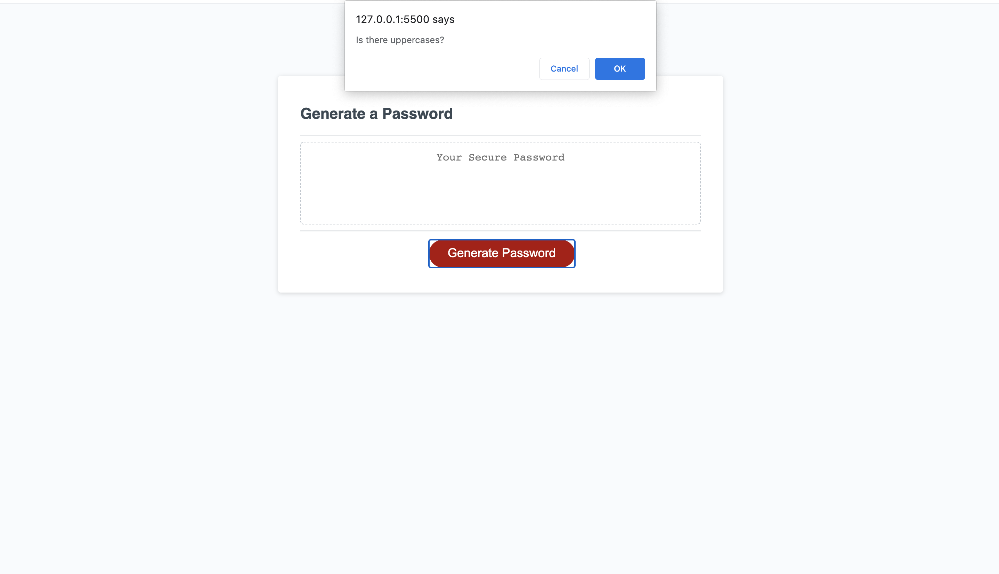
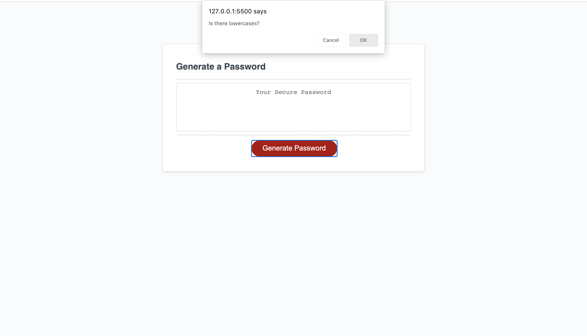
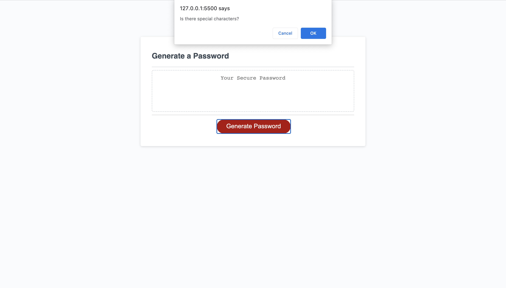
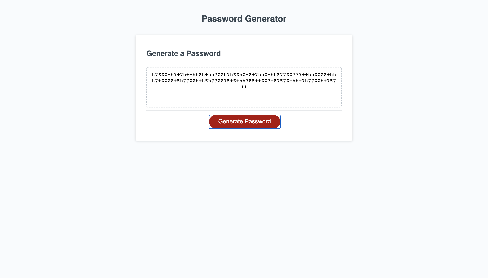

# 03-Password-Generator

This project is designed to generate a password based on the critieras selected once clicked on "Generate Password". Criterias include, being uppecase, being lowercase, having special characters, or having numbers. Before those critieras, you have the option on how many characters do you want, between 8 and 128 characters.

Click on generate to get the prompt.

There will be three prompts once the input prompt is completed. 

Uppercase criteria

Lowercase criterira

Number critieria 

Special character criteria 

Results after completing prompts.

